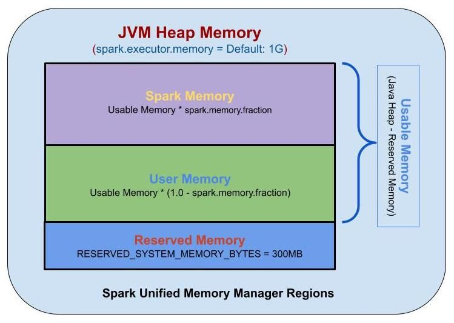

### Spark Memory
Spark에서 Memory 설정은 많은 부분에서 중요합니다. 메모리를 너무 크게 설정하여도 많은 Overhead와 자원 낭비를 발생시킬 수 있고, 너무 작게 설정하면 Out of Memory와 같은 문제가 발생할 수 있습니다.  
이렇듯 Memory 관리는 중요한 부분이고 Spark에서는 다양한 설정을 할 수 있습니다.  
이러한 설정을 위해서는 Spark의 Memory구조에 대한 이해가 필요할 것 입니다.

### Spark Memory 상세

Spark Meomory에는 크게 3가지 영역으로 볼 수 있다.  
1. Reserved Memory
Reserved Memory는 300MB로 고정되어 있습니다. Spark의 기타 기능 및 운영체제에서 사용하는 메모리 영역입니다.  

2. Spark Memory
Spark에서 사용하는 메모리 영역입니다. Cache, Broadcast 변수, 실행계획등이 저장되는 Storage Memory와 작업을 위해 필요한 메모리인 Execution Memory로 구성됩니다.  
Spark Memory의 크기는 Usable Memory(spark.executor.memory-reserved memory) * spark.memory.fraction 값입니다.  
- Storage Memory
  - 캐시와 브로드캐스트 변수, 실행계획등이 저장됩니다.
  - 캐싱할 공간이 부족한 LRU방식으로 이전 캐싱 값을 제거합니다.
  - Storage Memory의 크기는 Spark Meomry * storageFraction입니다.
- Exceution Memory
  - Task에 필요한 Memory입니다.
  - 메모리가 충분하지 않으실 디시크로 Spill을 하기 때문에 디스크 I/O가 발생할 수 있습니다.
  - Exceution Memory의 크기는 Spark Meomry*(1-storageFraction)입니다.

3. User Memory
사용자 코드에서 직정할당되는 메모리 영역입니다.  
Spark 내부 메타데이터, UDF등이 저장되는 공간입니다.  
User Memory의 크기는 Usable Memory * (1-spark.memory.fraction)

### Spark Memory Config
Spark에서 Memory 관련 주요 config입니다.  
|Configuration|설명|기타|
|------|---|---|
|spark.driver.memory|Driver process의 메모리양||
|spark.driver.memoryOverhaed|Driver process 별 non-heap의 메모리양|Cluster mode|
|spark.executor.memory|executor process의 메모리양||
|spark.executor.memoryOverhead|executor별 non-heap 메모리양||
|spark.executor.pyspark.memory|executor별 pyspark 메모리양|Pyspark를 사용하는 경우|
|spark.memory.fraction|실행 및 저장에 사용되는 힙 공간의 비율|기본값 0.6|
|spark.memory.storageFraction|memory.fraction에 의해 따로 설정된 공간 내 저장 영역의 크|기본값 0.5|

### 참고
1. Memory Overhaed란?
Spark Memory Config에서 memory라고 적힌 설정 뿐만아니라 memoryOverhead 설정도 있다. memoryOverhead는 meomory와 어떤 부분이 다를까?  
java에서 -xmx로 heap의 크기를 지정하고 실행 후 top으로 확인해보면 지정한 크기보다 더 크게 실행되는 것을 알 수 있다. heap size뿐만아니라 off-heap size도 포함되어 있기 때문이다.  
Spark에서는 off-heap size를 지정할 수 있다. off-heap 메모리는 JVM이 직접관리하지 않는다.  

- JVM Heap 메모리가 필요한 경우
  - 대용량의 데이터셋을 처리하는 경우
  - GC가 자주 발생하는 경우
- Off-Heap 메모리가 필요한 경우
  - Python을 사용하는 경우(JVM Heap과 다르기 때문)
  - 써드파티라이브러르(Parquet 등)
Overhead를 감안한 메모리는 다음과 같이 계산된다. 
``` 
MIN(executorMemory*0.1, 384MB)
```
ex:  
- executorMemory = 2g인 경우 Overhead는 384MB로 총 2.384GB 메모리를 사용하게된다.
- executorMemory = 5g인 경우 Overhead는 500MB로 총 5.5GB 메모리를 사용하게된다.

2. pyspark.memory란?
외부 프로세스 메모리의 일부(Off-heap 메모리)이며 파이썬 데몬이 얼마나 많은 메모리를 사용할지 정할 수 있습니다.  
해당 설정 값을 지정을 안한다면 memoryOverhead 내에서 자동으로 계산해서 할당합니다.  
예를 들어 파이썬에서 작성된 UDF를 실행하는데 사용됩니다. 

3. fraction과 StorageFraction
fraction과 StorageFraction는 JVM Heap 메모리 관련 설정입니다.  
fraction와 StorageFraction를 이해하기 전에 알아야 될 부분이 있습니다.  
Spark에서 메모리는 크게 2가지로 나뉩니다.  
- Execution Memory(실행 메모라): 작업(연산)에 사용되는 메모리입니다.(Shuffling, Sorting, groupBy 등)
- Storage Memory(저장 메모리) : 데이터 캐싱, 데이터 복제 등에 사용되는 메모리입니다.  
  
fraction은 executorMemory에서 얼마만큼의 비율로 Execution Memory와 Storage Memory를 사용하지 정할 수 있습니다.  
ex:  
- spark.executor.memory=10g, spark.memory.fraction=0.6이라면 6GB가 Execution Memory와 Storage Memory로 사용됩니다.  
  
fraction은 실행 메모리에서 실행과 저장에 얼마나 많은 메모리를 사용할지라면 StorageFraction는 실행과 저장에 사용되는 메모리에서 실행 메모리와 저장 메모리에 각각 어떻게 할당할지 정하는 설정입니다.  
ex:  
- spark.executor.memory=10g, spark.memory.fraction=0.1, spark.memory.storageFraction=0.6인 경우 Storage Memory는 0.6GB를 사용하고 Execution Memory에는 0.4GB를 사용합니다.  