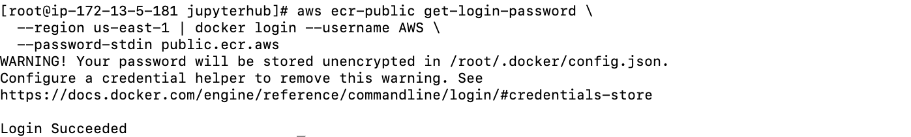
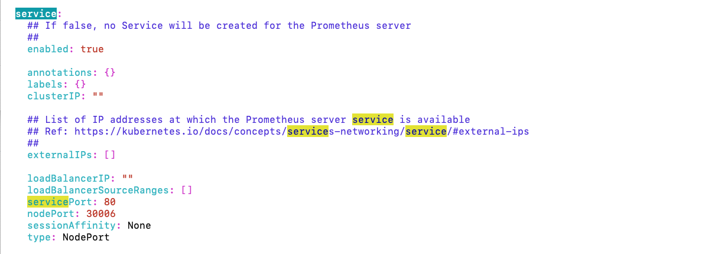
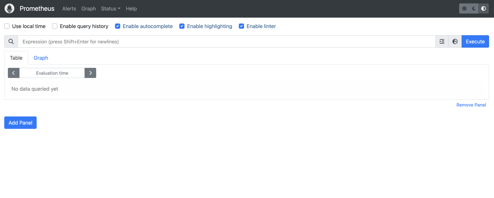

## 개요
`spark-on-k8s`에서는 EC2에서 K8S Cluster를 구성하여 Spark를 사용했더라면 해당 리포지토리에서는 AWS EKS에서 Spark를 사용하는 내용을 다룰려고합니다.  
  
EC2가 아닌 EKS에서 Spark를 구성하면 어떤 장점이 있는지 살펴보도록 하겠습니다.

## 아키텍처(초안)
저는 EKS에서 Spark환경을 다음과 같이 구성하고자 합니다.
  
  
## 1. API EC2 생성
EC2를 생성하여 EKS Cluster에 API를  EC2를 먼저 생성합니다.  
애플리케이션 및 OS 이미지 : Ubuntu Server 24.04 LTS (HVM), SSD Volume Type
인스턴스 유형 : t2.micro
VPC : EKS 클러스터 생성할 VPC
Subnet : 본인의 Pubilc Subnet
- EC2 접속
```
ssh -i <PEM_KEY> ubuntu@<PUBLIC_IP>
```
  
- root 유저로 변경
```
sudo su -
```

- AWS CLI v2 설치
```
curl "https://awscli.amazonaws.com/awscli-exe-linux-x86_64.zip" -o "awscliv2.zip"
unzip awscliv2.zip
sudo ./aws/install

aws --version
```  
  
- docker 설치
```
yum install docker -y

sudo service docker start
```
  
- eksctl 설치
```
curl --silent --location "https://github.com/weaveworks/eksctl/releases/latest/download/eksctl_$(uname -s)_amd64.tar.gz" | tar xz -C /tmp
sudo mv /tmp/eksctl /usr/local/bin

eksctl version
```
  
- kubectl 설치
```
curl -o kubectl https://amazon-eks.s3.us-west-2.amazonaws.com/1.19.6/2021-01-05/bin/linux/amd64/kubectl
chmod +x ./kubectl
mkdir -p $HOME/bin && cp ./kubectl $HOME/bin/kubectl && export PATH=$PATH:$HOME/bin
echo 'export PATH=$PATH:$HOME/bin' >> ~/.bashrc

kubectl version --short --client
```
  
- helm 설치
```
curl https://raw.githubusercontent.com/helm/helm/master/scripts/get-helm-3 > get_helm.sh
chmod 700 get_helm.sh
./get_helm.sh
```
  
- git 설치
```
dnf install git-all
```
  
## 2. EKS Cluster 생성 및 EBS CSI Driver 구성
- 환경 변수 선언
```
export KARPENTER_NAMESPACE="kube-system"
export KARPENTER_VERSION="1.0.8"
export K8S_VERSION="1.31"

export AWS_PARTITION="aws"
export AWS_DEFAULT_REGION="ap-northeast-2"
export CLUSTER_NAME="skdisco-dataiku-eks-test"
export AWS_ACCOUNT_ID="$(aws sts get-caller-identity --query Account --output text)"
export TEMPOUT="$(mktemp)"
export ARM_AMI_ID="$(aws ssm get-parameter --name /aws/service/eks/optimized-ami/${K8S_VERSION}/amazon-linux-2-arm64/recommended/image_id --query Parameter.Value --output text)"
export AMD_AMI_ID="$(aws ssm get-parameter --name /aws/service/eks/optimized-ami/${K8S_VERSION}/amazon-linux-2/recommended/image_id --query Parameter.Value --output text)"
export GPU_AMI_ID="$(aws ssm get-parameter --name /aws/service/eks/optimized-ami/${K8S_VERSION}/amazon-linux-2-gpu/recommended/image_id --query Parameter.Value --output text)"
```  
  
- KARPENTER 역할 생성
```
curl -fsSL https://raw.githubusercontent.com/aws/karpenter-provider-aws/v"${KARPENTER_VERSION}"/website/content/en/preview/getting-started/getting-started-with-karpenter/cloudformation.yaml  > "${TEMPOUT}" \
&& aws cloudformation deploy \
  --stack-name "Karpenter-${CLUSTER_NAME}" \
  --template-file "${TEMPOUT}" \
  --capabilities CAPABILITY_NAMED_IAM \
  --parameter-overrides "ClusterName=${CLUSTER_NAME}"
```  
  
- EKS Cluster 생성
대략 30분가량 걸립니다.
```
envsubst < eks-cluster.yaml | eksctl create cluster -f -
```
  
- kubeconfig 파일 생성
```
aws eks update-kubeconfig --region <REGION_CODE> --name <CLUSTER_NAME>
```
    
- Role 확인
```
eksctl get iamserviceaccount --cluster spark-on-eks
```
  
- aws-ebs-csi-driver 설치
```
eksctl create addon --name aws-ebs-csi-driver --cluster spark-on-eks --service-account-role-arn  <ebs-csi-controller-sa Role> --force
```
  
- Addon 설치 확인
```
eksctl get addon --cluster spark-on-eks
```
  
- csinode 확인
```
kubectl get csinodes
```
  
## 3. AWS ECR Repository 구성
쿠버네티스에 Pod를 배포할 때 Image 정보를 확인하여 DockerHub와 같은 이미지 저장소에서 Image를 설치하여 Pod에 배포합니다.  
- Public Registry 인증
```
aws ecr-public get-login-password \
  --region us-east-1 | docker login --username AWS \
  --password-stdin public.ecr.aws
```
  
  
- Public Repository 생성
`aws ecr-public create-repository --repository-name <레포지토리 명> --region us-east-1`
```
# Jupyterhub
aws ecr-public create-repository --repository-name spark-study/jupyterhub --region us-east-1

# Prometheus
aws ecr-public create-repository --repository-name spark-study/prometheus --region us-east-1
```
  
- Repository URL 확인
생성한 `spark-repo/spark` Repository의 Uri를 확인합니다.  
해당 Uri에 이미지를 Pull/Push할 것 입니다.  
```
# Jupyterhub URL
aws ecr-public describe-repositories --region us-east-1 | jq -r '.repositories[] | select(.repositoryName == "spark-study/jupyterhub") | .repositoryUri'

# Prometheus URL
aws ecr-public describe-repositories --region us-east-1 | jq -r '.repositories[] | select(.repositoryName == "spark-study/prometheus") | .repositoryUri'
```
  
- Spark 이미지 생성
JupyterHub에서 사용할 Spark 이미지와 Prometheus에서 사용할 이미지를 생성합니다.  
```
# JupyterHub 이미지
docker build -t public.ecr.aws/<레지스트리 별칭>/spark-study/jupyterhub -f /jupyterhub/Dockerfile .

# Prometheus에서 이미지
docker build -t public.ecr.aws/<레지스트리 별칭>/spark-study/prometheus -f /prometheus/Dockerfile .
```

## 3. Jupyterhub 구성
- `jupyterhub` 네임스페이스 생성
Jupyterhub의 자원들(pod, svc, pvc)은 `jupyterhub` 네임스페이스 관리할 것 입니다.   
```
kubectl create ns jupyterhub
```
  
- StorageClass & RBAC 생성
```
kubectl apply -f sc-jupyterhub.yaml

kubectl apply -f spark-rbac.yaml
```
  
- Install Jupyterhub
```
helm repo add jupyterhub https://hub.jupyter.org/helm-chart/

helm repo update

helm upgrade --cleanup-on-fail \
  --install jupyterhub jupyterhub/jupyterhub \
  --namespace jupyterhub \
  --create-namespace \
  --values config.yaml
```
  
- Jupyterhub 설치 확인
```
kubectl get pods -n jupyterhub
```
  
- Jupyterhub 접속
```
# 외부 IP 확인
kubectl get nodes -owide
```
  
`spark_user`로 로그인한 후 Spark 환경을 선택 합니다.  
다음과 같이 정상적으로 접속되고 AWS EBS가 생성될 것 입니다.  
  
  

## 4. Prometheus 구성
Jupyterhub의 자원들(pod, svc, pvc)은 `monitoring` 네임스페이스 관리할 것 입니다.  
- monitoring 네임스페이스 생성
```
kubectl create ns monitoring
```
  
- StorageClass 생성
```
kubectl apply -f sc-monitoring.yaml
```
  
- Prometheus Repo 추가
```
helm repo add prometheus-community https://prometheus-community.github.io/helm-charts

# repo list 확인
helm repo list

# local repository Update
helm repo update prometheus-community
```
  
- values 파일 설치
```
git clone https://github.com/prometheus-community/helm-charts.git
```
  
- values 파일 수정
`persistentVolume`에서 storageClass를 추가하고 `service`에서는 nodePort:30006으로 수정과 type을 NodePort로 변경합니다.   
```
vi /helm-charts/charts/prometheus/values.yaml

# 추가 및 수정
...
persistentVolume:
  ...
  storageClass: monitoring-sc
  ...
...
service:
  ...
  nodePort: 30006
  type: NodePort
  ...
```
  
  
- helm install
```
helm install prometheus prometheus-community/prometheus -f values.yaml --namespace monitoring
```
  
- 웹브라우저 확인
웹브라우저에 <Node_IP>:30006으로 접속하여 프로메테우스가 정상적으로 접속이되는지 확인 합니다.  
  

## 5. Karpenter 설치
EKS Cluster의 노드를 동적 확장을 위해서 Cluster AutoScaler와 Karpenter가 있습니다.  
Cluster AutoScaler는 ASG(Auto Scale Group)으로 노드를 확장 하므로 시간이 오래걸리자만, 반면에 Karpenter는 직접 노드를 확장하여 속도가 빠릅니다.  
그리고 Spot인스턴스도 생성할 수 있어 비용도 절감할 수 있습니다.  
마지막으로 consolidation을 통해 pod가 다른 노드에 이동하여 노드를 삭제할 수 있다면 pod를 이동시키고 노드를 삭제하여 자원 효율성을 높일 수 있습니다.  
  
- 권한 생성
```
curl -fsSL https://raw.githubusercontent.com/aws/karpenter-provider-aws/v"${KARPENTER_VERSION}"/website/content/en/preview/getting-started/getting-started-with-karpenter/cloudformation.yaml  > "${TEMPOUT}" \
&& aws cloudformation deploy \
  --stack-name "Karpenter-${CLUSTER_NAME}" \
  --template-file "${TEMPOUT}" \
  --capabilities CAPABILITY_NAMED_IAM \
  --parameter-overrides "ClusterName=${CLUSTER_NAME}"
```
  
- 환경 변수 선언
```
export CLUSTER_ENDPOINT="$(aws eks describe-cluster --name "${CLUSTER_NAME}" --query "cluster.endpoint" --output text)"
export KARPENTER_IAM_ROLE_ARN="arn:${AWS_PARTITION}:iam::${AWS_ACCOUNT_ID}:role/${CLUSTER_NAME}-karpenter"

echo "${CLUSTER_ENDPOINT} ${KARPENTER_IAM_ROLE_ARN}"
```  
  
- EC2 Spot fleet의 server-linked-role 확인
```
aws iam create-service-linked-role --aws-service-name spot.amazonaws.com || true
# If the role has already been successfully created, you will see:
# An error occurred (InvalidInput) when calling the CreateServiceLinkedRole operation: Service role name AWSServiceRoleForEC2Spot has been taken in this account, please try a different suffix.
```  
  
- Install Karpenter
```
# Logout of helm registry to perform an unauthenticated pull against the public ECR
helm registry logout public.ecr.aws

helm upgrade --install karpenter oci://public.ecr.aws/karpenter/karpenter --version "${KARPENTER_VERSION}" --namespace "${KARPENTER_NAMESPACE}" --create-namespace \
  --set "settings.clusterName=${CLUSTER_NAME}" \
  --set "settings.interruptionQueue=${CLUSTER_NAME}" \
  --set controller.resources.requests.cpu=1 \
  --set controller.resources.requests.memory=1Gi \
  --set controller.resources.limits.cpu=1 \
  --set controller.resources.limits.memory=1Gi \
  --set settings.featureGates.spotToSpotConsolidation=true \
  --wait
```
  
- NodeClass 생성
```
cat <<EOF | envsubst | kubectl apply -f - 
apiVersion: karpenter.k8s.aws/v1
kind: EC2NodeClass
metadata:
  name: default
spec:
  amiFamily: AL2 # Amazon Linux 2
  role: "KarpenterNodeRole-${CLUSTER_NAME}" # replace with your cluster name
  subnetSelectorTerms:
  - tags:
      karpenter.sh/discovery: "${CLUSTER_NAME}" # replace with your cluster name
  securityGroupSelectorTerms:
  - tags:
      karpenter.sh/discovery: "${CLUSTER_NAME}" # replace with your cluster name
  # EBS Option
  blockDeviceMappings:
    - deviceName: /dev/xvda
      ebs:
        volumeSize: 50Gi
        volumeType: gp3
        iops: 3000
        throughput: 125
        deleteOnTermination: true
EOF
```
  
- NodePool 생성
```
cat <<EOF | envsubst | kubectl apply -f -
apiVersion: karpenter.sh/v1
kind: NodePool
metadata:
  name: default
spec:
  template:
    spec:
      requirements:
        - key: kubernetes.io/arch
          operator: In
          values: ["amd64"]
        - key: kubernetes.io/os
          operator: In
          values: ["linux"]
        - key: karpenter.sh/capacity-type
          operator: In
          values: ["spot"]
        - key: karpenter.k8s.aws/instance-category
          operator: In
          values: ["c", "m", "r"]
      nodeClassRef:
        group: karpenter.k8s.aws
        kind: EC2NodeClass
        name: default
      expireAfter: 720h # 30 * 24h = 720h
  limits:
    cpu: 1000
  disruption:
    consolidationPolicy: WhenEmptyOrUnderutilized
    consolidateAfter: 1m
EOF
```  
  
- 설치 확인
```
kubectl get ec2nodeclass

kubectl get nodepool
```

## 6. Trivy
Trivy는 컨테이너와 컨테이너를 제외한 artifacts(Filesystem, Git Repositories)에 대한 취약점을 분석하는 스캐너입니다.  
OS 패키지(Alpine, RHEL, CentOS 등)와 애플리케이션 종속성(Builder, Composer, npm, yarn 등)의 취약성을 감지합니다.  

- 설치(v0.57)
참고 : https://aquasecurity.github.io/trivy/v0.57/getting-started/installation/  

```
cat << EOF | sudo tee -a /etc/yum.repos.d/trivy.repo
[trivy]
name=Trivy repository
baseurl=https://aquasecurity.github.io/trivy-repo/rpm/releases/\$basearch/
gpgcheck=1
enabled=1
gpgkey=https://aquasecurity.github.io/trivy-repo/rpm/public.key
EOF
sudo yum -y update
sudo yum -y install trivy
```

- 이미지 스캔
이미지가 크거나 임시 디렉토리가 충분하지 않은 경우 스캔이 실패합니다. 이런 경우 디렉토리 경로를 지정(`TMPDIR`)하여 Trivy를 충분히 사용 가능한 디렉토리로 redirect할 수 있습니다.  

```
TMPDIR=/ trivy image hiha2/prometheus
```
