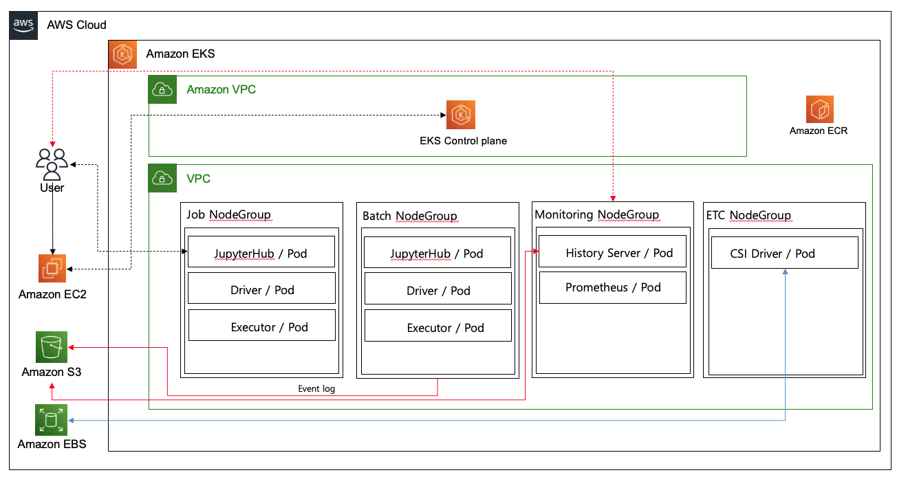
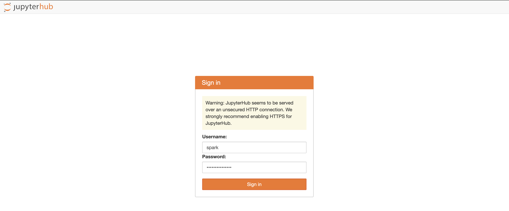
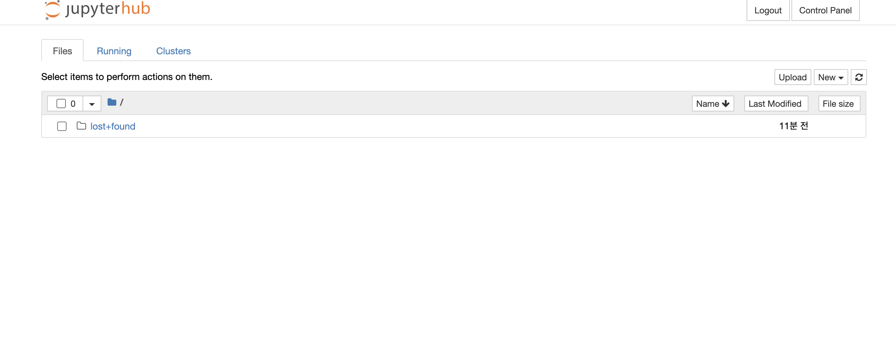
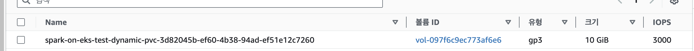

## 개요
`spark-on-k8s`에서는 EC2에서 K8S Cluster를 구성하여 Spark를 사용했더라면 해당 리포지토리에서는 AWS EKS에서 Spark를 사용하는 내용을 다룰려고합니다.  
  
EC2가 아닌 EKS에서 Spark를 구성하면 어떤 장점이 있는지 살펴보도록 하겠습니다.

## 아키텍처
저는 EKS에서 Spark환경을 다음과 같이 구성하고자 합니다.
  
Karpenter, AWS CSI EBS Driver,Graceful Executor Decommissioning 적용 예정입니다.  
  

## 1. API용 EC2 생성
EC2를 생성하여 EKS Cluster에 API를  EC2를 먼저 생성합니다.  
애플리케이션 및 OS 이미지 : Ubuntu Server 24.04 LTS (HVM), SSD Volume Type
인스턴스 유형 : t2.micro
VPC : EKS 클러스터 생성할 VPC
Subnet : 본인의 Pubilc Subnet
- EC2 접속
```
ssh -i <PEM_KEY> ubuntu@<PUBLIC_IP>
```
  
- root 유저로 변경
```
sudo su -
```

- AWS CLI v2 설치
```
curl "https://awscli.amazonaws.com/awscli-exe-linux-x86_64.zip" -o "awscliv2.zip"
unzip awscliv2.zip
sudo ./aws/install

aws --version
```
  
- eksctl 설치
```
curl --silent --location "https://github.com/weaveworks/eksctl/releases/latest/download/eksctl_$(uname -s)_amd64.tar.gz" | tar xz -C /tmp
sudo mv /tmp/eksctl /usr/local/bin

eksctl version
```
  
- kubectl 설치
```
curl -o kubectl https://amazon-eks.s3.us-west-2.amazonaws.com/1.19.6/2021-01-05/bin/linux/amd64/kubectl
chmod +x ./kubectl
mkdir -p $HOME/bin && cp ./kubectl $HOME/bin/kubectl && export PATH=$PATH:$HOME/bin
echo 'export PATH=$PATH:$HOME/bin' >> ~/.bashrc

kubectl version --short --client
```
  
- helm 설치
```
curl https://raw.githubusercontent.com/helm/helm/master/scripts/get-helm-3 > get_helm.sh
chmod 700 get_helm.sh
./get_helm.sh
```
  
## 2. EKS Cluster 생성 및 EBS CSI Driver 구성
- EKS Cluster 생성
대략 30분가량 걸립니다.
```
kubectl apply -f eks-cluster.yaml
```
  
- Role 확인
```
eksctl get iamserviceaccount --cluster spark-on-eks
```
  
- aws-ebs-csi-driver 설치
```
eksctl create addon --name aws-ebs-csi-driver --cluster spark-on-eks --service-account-role-arn  <ebs-csi-controller-sa Role> --force
```
  
- Addon 설치 확인
```
eksctl get addon --cluster spark-on-eks
```
  
- csinode 확인
```
kubectl get csinodes
```
  
## 3. Jupyterhub 구성
- `jupyterhub` 네임스페이스 생성
Jupyterhub의 자원들(pod, svc, pvc)은 `jupyterhub` 네임스페이스 관리할 것 입니다.   
```
kubectl create ns jupyterhub
```
  
- StorageClass & RBAC 생성
```
kubectl apply -f sc-jupyterhub.yaml

kubectl apply -f spark-rbac.yaml
```
  
- Install Jupyterhub
```
helm repo add jupyterhub https://hub.jupyter.org/helm-chart/

helm repo update

helm upgrade --cleanup-on-fail \
  --install jupyterhub jupyterhub/jupyterhub \
  --namespace jupyterhub \
  --create-namespace \
  --values config.yaml
```
  
- Jupyterhub 설치 확인
```
kubectl get pods -n jupyterhub
```
  
- Jupyterhub 접속
```
# 외부 IP 확인
kubectl get nodes -owide
```
  
`spark_user`로 로그인한 후 Spark 환경을 선택 합니다.  
다음과 같이 정상적으로 접속되고 AWS EBS가 생성될 것 입니다.  
  
  

