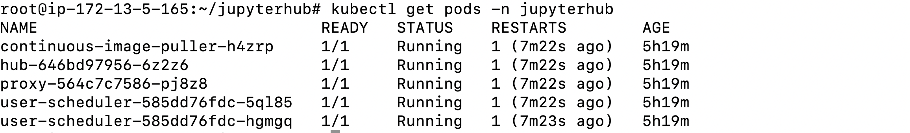
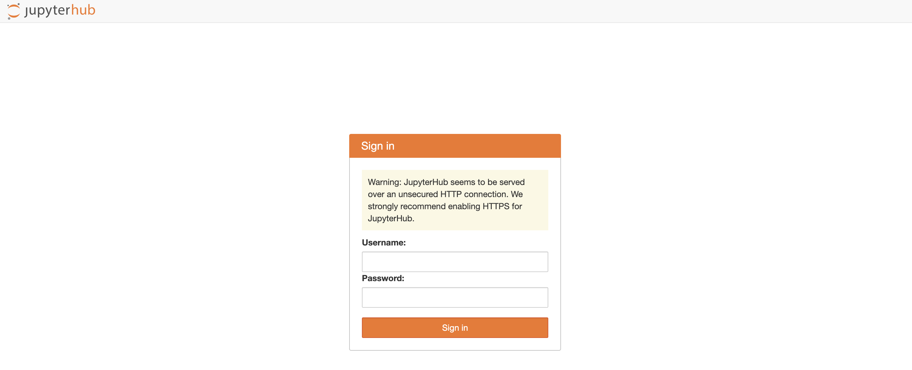
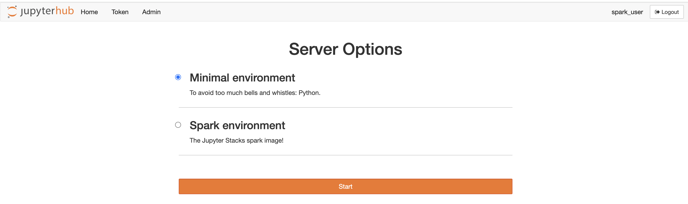
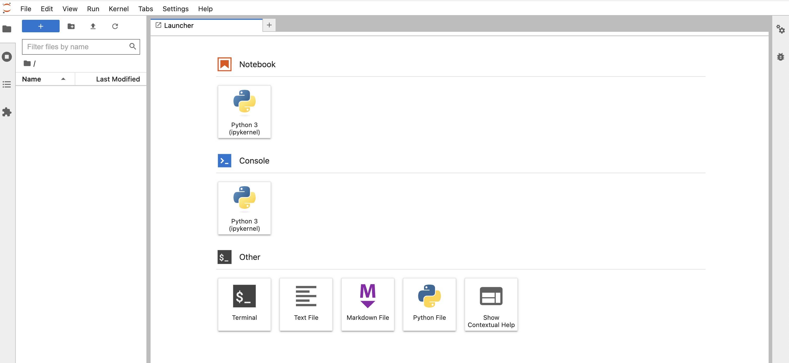
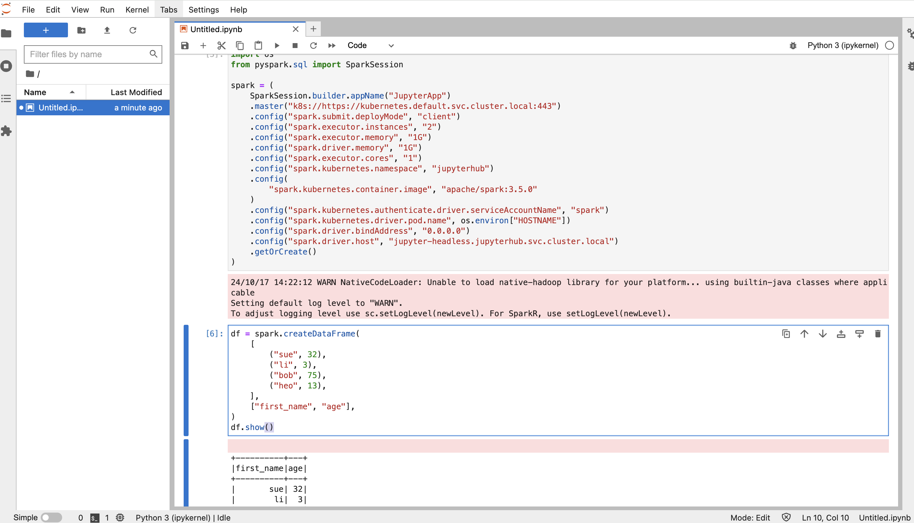
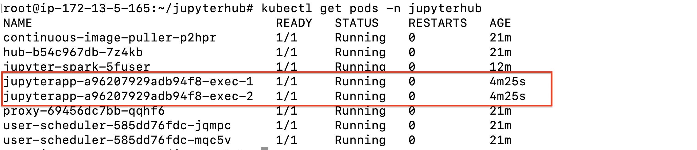
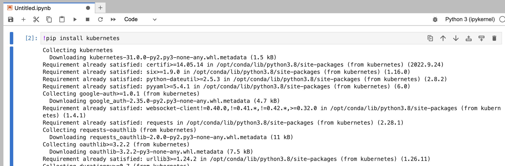
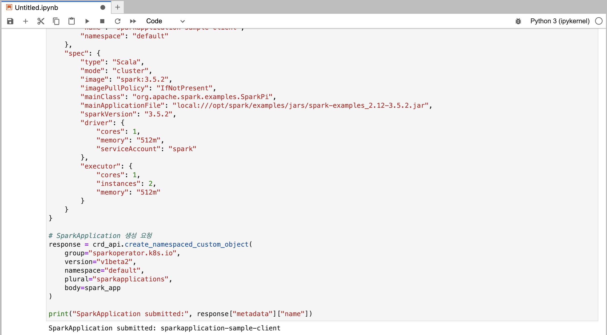
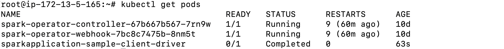
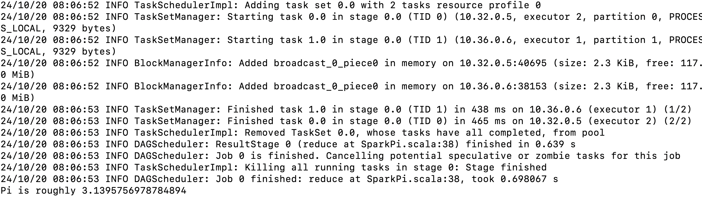

## 개요
처음에는 Spark Client Mode를 사용하여 Jupyter Notebook에서 Spark를 사용하는 것으로 마무리하려고 했으나, [kubeflow/spark-operator](https://github.com/kubeflow/spark-operator/issues)에서 JupyterHub에서 Spark 사용에 대한 이슈가 이슈가 많이 올라와서 JupyterHub에 대한 궁금함과 한 번 사용해볼겸 구성해보려고 합니다.  

## JupyterHub란?
JupyterHub가 뭔지 그리고 Jupyter Notebook과 무엇이 다른지 알아봅시다.  
JupyterHub란 다중 사용자가 Jupyter Notebook을 이용할 수 있는 환경입니다.  
Notebook 사용자 마다 어떤 사람은 R을 사용하고 싶을 수 있고 또는 Python, Spark 등을 사용하고 싶을 수 있습니다.  
즉 사용자 마다 Notebook 사용 목적이 다릅니다. 이때 JupyterHub를 이용하며 사용자별로 Notebook 환경을 구성할 수 있습니다.  
그리고 사용자 별로 다앙햔 인증 등을 사용할 수 있습니다.  

## K8S 사용 리소스
### [Jupyterhub Helm Conifg](https://github.com/ha2hi/spark-study/blob/main/spark-on-k8s/Jupyter-Hub/config.yaml)  
Helm을 사용하여 Jupyterhub를 설치할 때 config.yaml에 구성하고 싶은 환경을 구성할 수 있습니다.  
- hub
  - config.Authenticator.admin_users[] : User 설정
  - config.DummyAuthenticator.password : PW 설정
  - JupyterHub.authenticator_class : 사용자 인증방식으로 모든 User의 패스워드를 DummyAuthenticator.password에서 설정한 값으로 지정
- singleuser
  - nodeSelector.kubernetes.io/hostname : Hub를 배포할 Node IP 입력
  - profileList: 저는 2개의 환경을 생성했습니다. (Storage Class 분리)
  - Spark 이미지는 이전에 [Jupyter-Notebook](https://github.com/ha2hi/spark-study/blob/main/spark-on-k8s/Jupyter-Notebook/Dockerfile)구성 당시 사용한 이미지를 그대로 사용했습니다.
- proxy.service.type : NodePort, 설정 안하면 LB Type으로 SVC가 생성됩니다.  

### [RBAC](https://github.com/ha2hi/spark-study/blob/main/spark-on-k8s/Jupyter-Hub/spark-rbac.yaml)
`config.yaml` 파일에서 `singleuser.serviceAccountName: spark` 지정한 RBAC입니다.  

### [Storage Class](https://github.com/ha2hi/spark-study/blob/main/spark-on-k8s/Jupyter-Hub/sc.yaml)
`config.yaml`에서 Python과 Spark 환경의 Storage Class를 각각 구성되게 만들었습니다.  
  
### Persistent Volumes
[python-pv](https://github.com/ha2hi/spark-study/blob/main/spark-on-k8s/Jupyter-Hub/python-pv.yaml), [spark-pv](https://github.com/ha2hi/spark-study/blob/main/spark-on-k8s/Jupyter-Hub/spark-pv.yaml)
  
### [Service](https://github.com/ha2hi/spark-study/blob/main/spark-on-k8s/Jupyter-Hub/headless-service.yaml)
Spark Clint Mode를 사용하기 위해 headless-service를 구성했습니다.

## 작업
### 1. 사용 리소스 실행
- ServiceAccount 생성 및 롤바인딩
```
kubectl apply -f spark-rbac.yaml
```
  
- Storage Class 생성
```
kubectl apply -f sc.yaml
```
  
- PV 생성
```
kubectl apply -f hub-pv.yaml

kubectl apply -f python-pv.yaml

kubectl apply -f spark-pv.yaml
```
  
- Service 생성
```
kubectl apply -f headless-service.yaml
```

### 2. JupyterHub 서버 실행
저는 `jupyterhub` 네임스페이스에 Hub를 구성했습니다.  
```
helm upgrade --cleanup-on-fail \
  --install jupyterhub jupyterhub/jupyterhub \
  --namespace jupyterhub \
  --create-namespace \
  --values config.yaml
```
`hub`와 `proxy` Pod가 정상적으로 실행되고 있는지 확인합니다.  

  
이제 hub에 접속해보겠습니다.
웹 브라우저를 열고 `<k8s-Node-IP>:30080` 접속합니다.  
로그인창이 나올 것 입니다.
  
  
Spark User로 접속해보겠습니다.  
Username : spark_user  
Password : a-shared-secret-password  
그럼 다음과 같이 `config.yaml`에서 설정한대로 2개의 환경(Python, Spark)이 보일 것 입니다.  
  
  
`Spark environment`를 선택하고 Start하여 접속하겠습니다.  
다음과 같이 Spark 환경이 접속될 것 입니다.  
  

### 3. Spark 사용
Jupyter에서 Spark 사용은 지난번에 Jupyter Notebook에서 사용하는 것 과 같은 방식인 headless-service를 사용하여 다뤄볼 것 입니다.  
- SparkSession 생성
```
import os
from pyspark.sql import SparkSession

spark = (
    SparkSession.builder.appName("JupyterApp")
    .master("k8s://https://kubernetes.default.svc.cluster.local:443")
    .config("spark.submit.deployMode", "client")
    .config("spark.executor.instances", "2")
    .config("spark.executor.memory", "1G")
    .config("spark.driver.memory", "1G")
    .config("spark.executor.cores", "1")
    .config("spark.kubernetes.namespace", "jupyterhub")
    .config(
        "spark.kubernetes.container.image", "apache/spark:3.5.0"
    )
    .config("spark.kubernetes.authenticate.driver.serviceAccountName", "spark")
    .config("spark.kubernetes.driver.pod.name", os.environ["HOSTNAME"])
    .config("spark.driver.bindAddress", "0.0.0.0")
    .config("spark.driver.host", "jupyter-headless.jupyterhub.svc.cluster.local")
    .getOrCreate()
)
```
- Spark DataFrame example
```
df = spark.createDataFrame(
    [
        ("sue", 32),
        ("li", 3),
        ("bob", 75),
        ("heo", 13),
    ],
    ["first_name", "age"],
)
df.show()
```
다음과 같이 정상적으로 pod가 생성되고 DataFrame이 보일 것 입니다.  
  
  

### 4. Kubernetes Python Client를 사용하여 Spark Operator에 작업 배포
JupyterHub에서 Spark Operator에 CRD로 작업을 제출하고 싶을 때 Kubernetes Python Client를 사용하여 배포할 수 있습니다.  
URL : https://github.com/kubernetes-client/python  
  
- K8S Python Client 설치
제가 JupyterHub의 Spark 환경을 배포할 때 사용한 이미지에는 PyPI에 `kubernetes` 패키지를 설치하지 않았기 때문에 Notebook에서 직접 설치하도록 하겠습니다.  
```
!pip install kubernetes
```
  
  
- 작업 제출
저는 JupyterHub를 K8S Cluster 내부에서 배포한 것 이므로 `config.load_incluster_config()`으로 설정 파일을 정의했지만 외부에서 실행하는 경우 `config.load_kube_config()`를 사용해야 됩니다.  
그리고 Spark Operator는 현재 `default` Namespace에서 사용하고 있습니다.  
  
  
CRD를 JSON으로 정의하고 배포합니다.  
```
from kubernetes import client, config

# 클러스터 내부 config
config.load_incluster_config()

crd_api = client.CustomObjectsApi()

spark_app = {
    "apiVersion": "sparkoperator.k8s.io/v1beta2",
    "kind": "SparkApplication",
    "metadata": {
        "name": "sparkapplication-sample-client",
        "namespace": "default"
    },
    "spec": {
        "type": "Scala",
        "mode": "cluster",
        "image": "spark:3.5.2",
        "imagePullPolicy": "IfNotPresent",
        "mainClass": "org.apache.spark.examples.SparkPi",
        "mainApplicationFile": "local:///opt/spark/examples/jars/spark-examples_2.12-3.5.2.jar",
        "sparkVersion": "3.5.2",
        "driver": {
            "cores": 1,
            "memory": "512m",
            "serviceAccount": "spark"
        },
        "executor": {
            "cores": 1,
            "instances": 2,
            "memory": "512m"
        }
    }
}

# SparkApplication 생성
response = crd_api.create_namespaced_custom_object(
    group="sparkoperator.k8s.io",
    version="v1beta2",
    namespace="default",
    plural="sparkapplications",
    body=spark_app
)

# 디버깅
print("SparkApplication submitted:", response["metadata"]["name"])
```
  

```
kubectl get pods -n default
```
  
```
kubectl logs sparkapplication-sample-client-driver
```
  